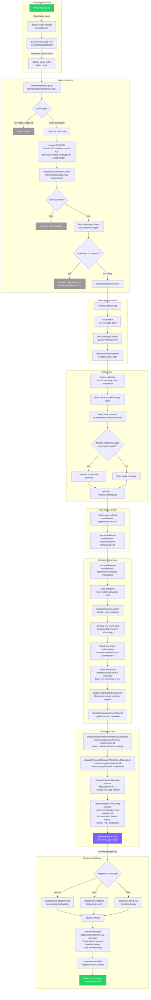

```mermaid
graph TD
    subgraph WhatsApp Protocol
        A[WhatsApp Server] -->|WebSocket frame| B[Baileys noise-handler<br/>decodeFrame]
        B --> C[Baileys messages-recv<br/>processNodeWithBuffer]
        C -->|messages.upsert event| D[Baileys event-buffer<br/>flush + emit]
    end

    subgraph Inbound Monitor
        D --> E[handleMessagesUpsert<br/>src/web/inbound/monitor.ts:154]
        E --> F{upsert.type?}
        F -->|not notify or append| Z1[return - ignore]
        F -->|notify or append| G[Loop: for each msg]

        G --> H[resolveJidToE164<br/>Convert JID to phone number<br/>e.g. 15551234567@s.whatsapp.net → +15551234567]
        H --> I[checkInboundAccessControl<br/>src/web/inbound/access-control.ts:20]
        I --> J{access.allowed?}
        J -->|false| Z2[continue - skip message]
        J -->|true| K[Mark message as read<br/>sock.readMessages]

        K --> L{upsert.type === append?}
        L -->|yes| Z3[continue - skip auto-reply<br/>historical/offline catch-up]
        L -->|no - notify| M[Extract message content]
    end

    subgraph Message Extraction
        M --> M1[extractLocationData]
        M1 --> M2[extractText<br/>Get message body]
        M2 --> M3[describeReplyContext<br/>Quoted message info]
        M3 --> M4[downloadInboundMedia<br/>Images, audio, docs]
    end

    subgraph Debouncer
        M4 --> N[Define callbacks<br/>sendComposing, reply, sendMedia]
        N --> O[Build WebInboundMessage object]
        O --> P[debouncer.enqueue<br/>src/web/inbound/monitor.ts:331]
        P --> Q{Multiple rapid messages<br/>from same sender?}
        Q -->|yes| R[Combine bodies with newlines]
        Q -->|no| S[Pass single message]
        R --> T[onFlush → options.onMessage]
        S --> T
    end

    subgraph Auto-Reply Monitor
        T --> U[onMessage callback<br/>src/web/auto-reply/monitor.ts:207]
        U --> V[processForRoute<br/>src/web/auto-reply/monitor/on-message.ts:167]
    end

    subgraph Message Processing
        V --> W[processMessage<br/>src/web/auto-reply/monitor/process-message.ts]
        W --> W1[Echo detection<br/>Skip if bot is replying to itself]
        W1 --> W2[maybeSendAckReaction<br/>Send 👍 typing reaction]
        W2 --> W3[Resolve text chunk limit<br/>Default 4000 chars for WhatsApp]
        W3 --> W4[Check command authorization<br/>Is sender allowed to run /commands?]
        W4 --> W5[Build ctxPayload<br/>finalizeInboundContext with Body,<br/>From, To, SessionKey, etc.]
        W5 --> W6[updateLastRouteInBackground<br/>Remember where to deliver replies]
        W6 --> W7[recordSessionMetaFromInbound<br/>Update session metadata]
    end

    subgraph Dispatch Chain
        W7 --> X1[dispatchReplyWithBufferedBlockDispatcher<br/>src/auto-reply/reply/provider-dispatcher.ts:14<br/>Select buffered dispatch strategy]
        X1 --> X2[dispatchInboundMessageWithBufferedDispatcher<br/>src/auto-reply/dispatch.ts:34<br/>Create typing indicator + dispatcher]
        X2 --> X3[dispatchInboundMessage<br/>src/auto-reply/dispatch.ts:17<br/>Finalize message context]
        X3 --> X4[dispatchReplyFromConfig<br/>src/auto-reply/reply/dispatch-from-config.ts:82<br/>Orchestration: hooks, dedup,<br/>routing, TTS, diagnostics]
        X4 --> X5[getReplyFromConfig<br/>Send message to LLM]
    end

    subgraph Response Delivery
        X5 -->|streaming response| Y1{Response chunk type}
        Y1 -->|tool use| Y2[dispatcher.sendToolResult<br/>Intermediate tool update]
        Y1 -->|block| Y3[dispatcher.sendBlock<br/>Streaming chunk]
        Y1 -->|final| Y4[dispatcher.sendFinal<br/>Completed reply]

        Y2 --> Y5[deliver callback]
        Y3 --> Y5
        Y4 --> Y5

        Y5 --> Y6[deliverWebReply<br/>Apply responsePrefix e.g. openclaw<br/>Chunk text if over limit<br/>Send via Baileys sock.sendMessage]
        Y6 --> Y7[rememberSentText<br/>Register in echo tracker]
        Y7 --> Y8[WhatsApp message<br/>delivered to user]
    end

    style A fill:#25D366,color:#fff
    style Y8 fill:#25D366,color:#fff
    style X5 fill:#7B61FF,color:#fff
    style Z1 fill:#999,color:#fff
    style Z2 fill:#999,color:#fff
    style Z3 fill:#999,color:#fff
```
